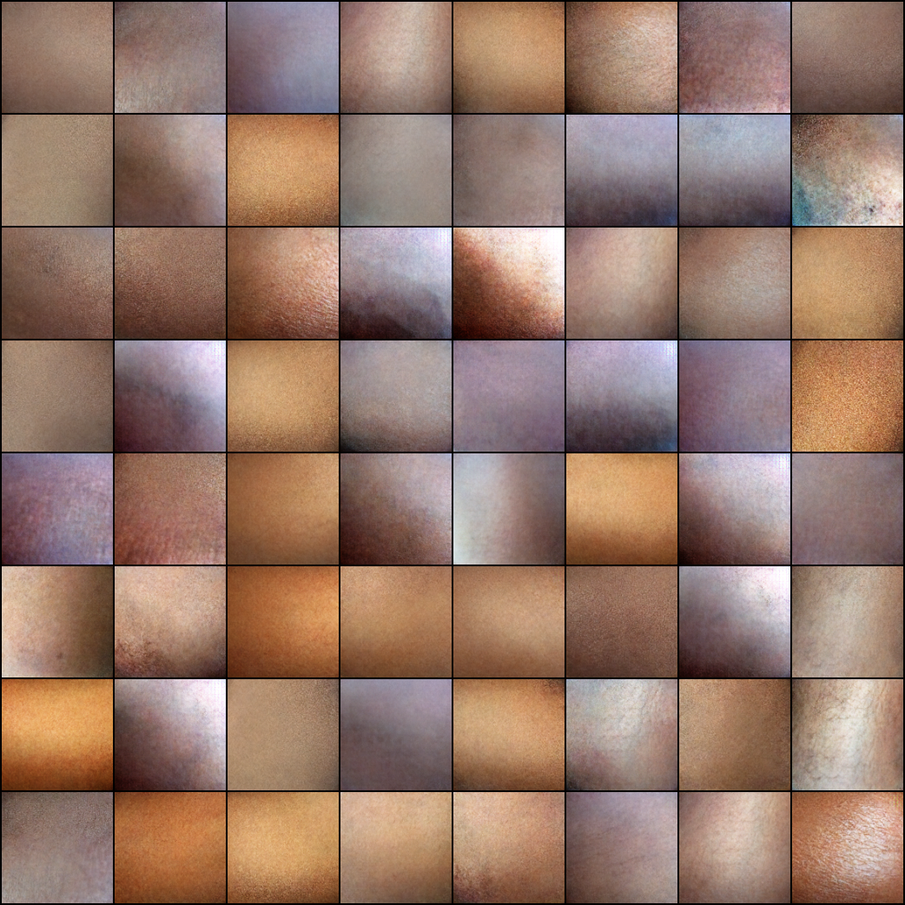
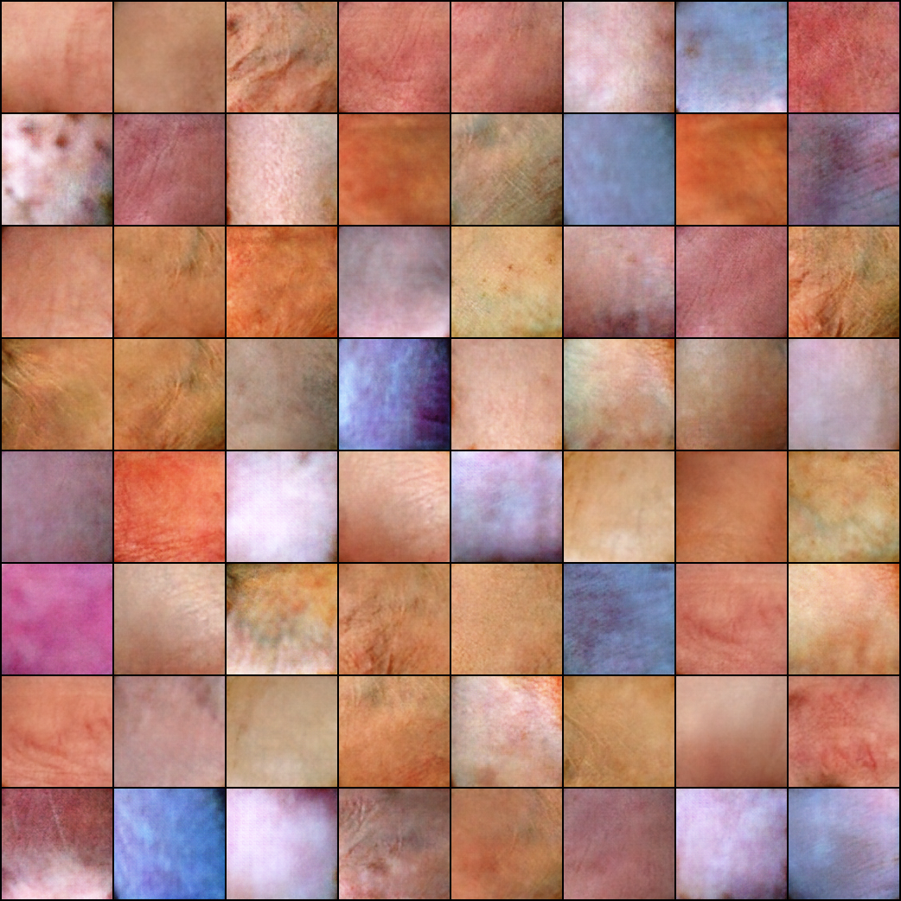
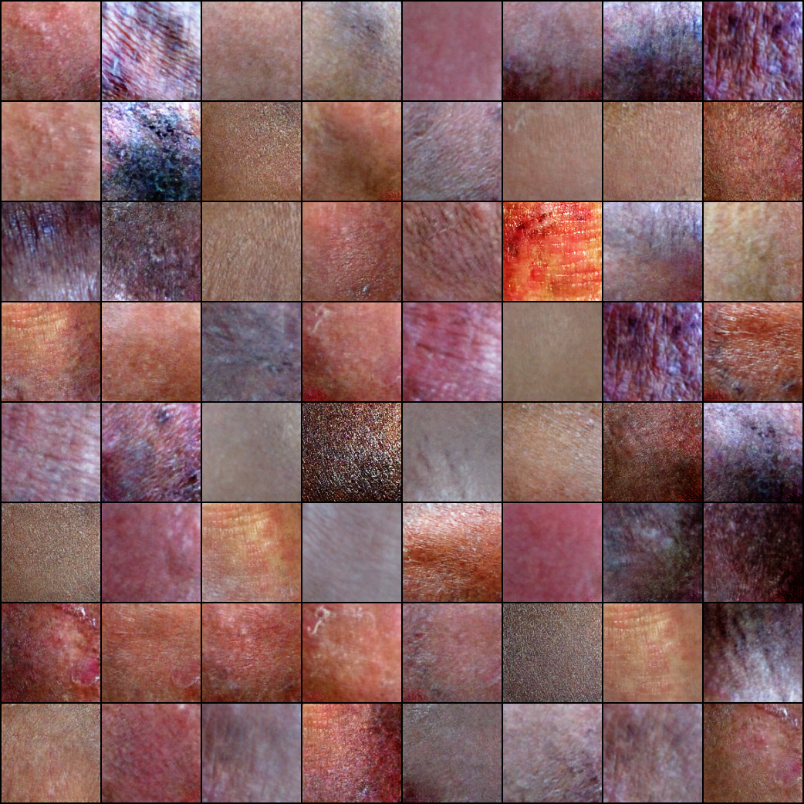
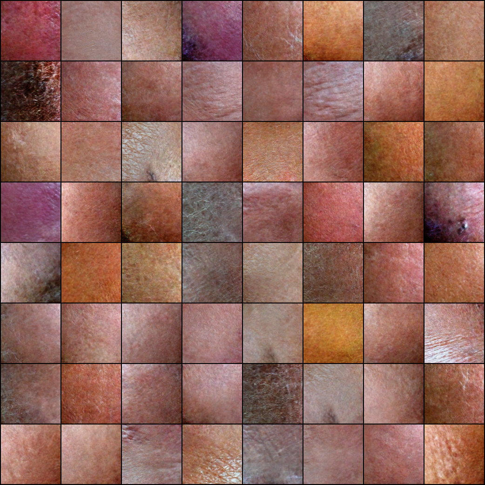

## Implementation of Wasserstien GAN with Gradient Penalty.

### A few generated samples.
#### Synthetic Normal Skin

#### Synthetic Vitiligo

#### Synthetic TineaVersicolor

#### Synthetic Leprosy

